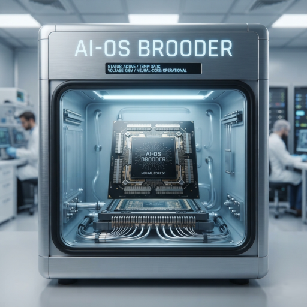
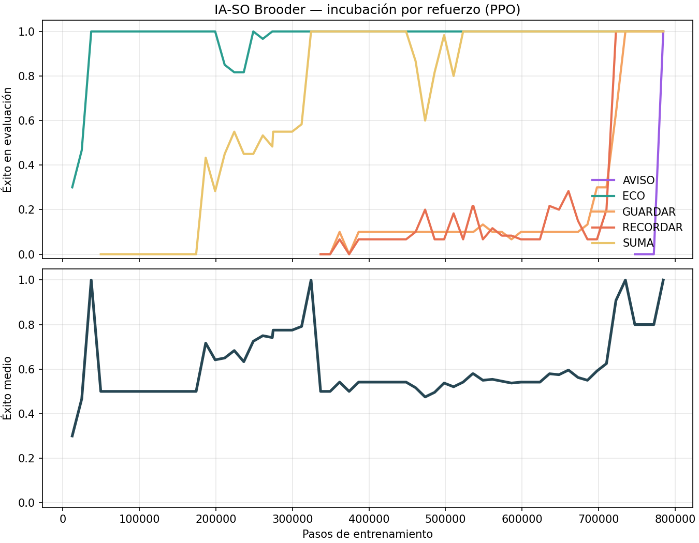

<div align="center">
<p></p>

# IA-SO BROODER (AI-OS Brooder)

### *An operating system that is incubated, not installed.*

[](.github/workflows/ci.yml)
[](LICENSE)
[](pyproject.toml)
[](https://pytorch.org)

**A neural network learns, by pure reinforcement, to operate a computer.
It is trained on an "incubator" machine, exported as an SSD image, and
"born" on another PC, where it serves user requests by managing CPU,
RAM, disk, screen and audio through a primitive-interface contract.**

**Author:** [Justo Tapiador García](mailto:justo.tapiador@gmail.com)
**Original idea together with:** Albert Zotkin

Versión en español: **[README-ES.md](README-ES.md)**

</div>

---

## Contents

1. [What is this?](#what-is-this)
2. [Results](#results)
3. [Quick start](#quick-start)
4. [The web emulator — IA-SO in your browser](#the-web-emulator--ia-so-in-your-browser)
5. [The birth SSD: recommended hardware](#the-birth-ssd-recommended-hardware)
6. [Security: primitives, not hardware](#security-primitives-not-hardware)
7. [Architecture](#architecture)
8. [How Brooder learns](#how-brooder-learns)
9. [Roadmap](#roadmap)
10. [Authors and acknowledgements](#authors-and-acknowledgements)
11. [License](#license)


## What is this?

IA-SO Brooder is an experiment in an **operating system governed by a
neural network**. It was born from a conversation between two friends:

> "What if an AI, once trained, were stored on an SSD — and when the PC
> booted, it behaved like a true operating system, waiting for inputs
> from its peripherals in order to produce outputs?"

The keystone of the design: **the AI never has direct access to the
hardware**. Instead, it is offered a set of **primitive interfaces** —
`leer_teclado()` (read keyboard), `escribir_disco()` (write disk),
`usar_cpu()` (use CPU), `mostrar_en_pantalla()` (show on screen)... —
and the AI **learns by itself** how to use them. This way we avoid the
monstrous problem of "how to make a neural network understand every
instruction of a modern CPU".

```
     INCUBATOR                   SSD                  BIRTH PC
┌─────────────────┐        ┌───────────┐       ┌────────────────────────┐
│  powerful       │        │  brooder  │       │  CPU + GPU             │
│  machine        │        │  .img     │       │                        │
│  PPO +          │───────►│ (262 KiB) │──────►│  BIOS → kernel → AI-OS │
│  curriculum     │        └───────────┘       │                        │
│  ~14 min on CPU │      export / mount        │  ECO · SUMA · GUARDAR  │
└─────────────────┘                           │  RECORDAR · AVISO      │
     trains                                    └────────────────────────┘
```

---

## Results

The brain included in `ssd/brooder.img` is the same one from Fase 0.5,
**transplanted** into the new contract (perception 21→24 inputs,
primitives 18→20 outputs: see `docs/dispositivo-virtual.md`), refined
to 1,975,637 total PPO steps and **re-incubated in v0.4.0 with
connector variability** (+20,585 steps: see
`docs/variabilidad-conector.md`, in Spanish). Deterministic evaluation
on fresh requests, verified by the hardware itself — now on every
state of the USB connector:

| Task | What Brooder must do | Success |
|------|----------------------|---------|
| `ECO` (echo) | read the keyboard and repeat it on screen | **100 %** |
| `SUMA` (add) | read two digits, add them **with the CPU** and show the result | **100 %** |
| `GUARDAR` (save) | store a value on the **disk** and retrieve it | **100 %** (tracing 91 %) |
| `RECORDAR` (recall) | same, but in **RAM** | **100 %** (tracing 91 %) |
| `AVISO` (alert) | show a character and **beep** upon reading the alarm | **100 %** |
| `DISPOSITIVO` (device) | mount/unmount the **virtual pendrive** according to its state | **100 %** |

**Connector invariance (v0.4.0):** the classic tasks are solved at
100 % with the pendrive **empty, plugged or mounted with residual
data** — the minimum across states, not the average (v0.3.0 dropped
to 48 % with the pendrive mounted; see
[`docs/variabilidad-conector.md`](docs/variabilidad-conector.md)).

None of this is hand-programmed: **the neural network decides the
sequence of primitives at every cycle**. It does not even imitate the
"ideal program": in GUARDAR, for instance, Brooder invented its own
legal variant.



---

## Quick start

```bash
# clone and install (Python 3.9+)
git clone https://github.com/Justo-Tapiador/ia-so-brooder.git
cd ia-so-brooder
pip install -e ".[dev]"

# try the system with the pre-incubated brain (7/7 requests)
brooder demo

# power on the AI-OS and talk to it (interactive session)
brooder arrancar

#   brooder> HOLA            <- echo
#   brooder> 3+5             <- addition with the CPU (result: 8)
#   brooder> guardar 4 G     <- writes 'G' to disk slot 4 and retrieves it
#   brooder> recordar 2 Z    <- same, but in RAM
#   brooder> aviso A         <- shows 'A' and beeps on reading the alarm
#   brooder> :recovery       <- emergency menu, independent of the AI

# (optional) incubate your own brain and boot it
brooder incubar              # ~14 min on CPU; all 6 tasks with connector variability
brooder exportar             # packages entrenamiento/mejor.pt into ssd/brooder.img
brooder demo                 # now the AI is yours

# (optional) over YOUR real filesystem, sandboxed
brooder demo --maquina-real  # Brooder's disk becomes real files
ls brooder_sandbox/disco/    # 0.tok ... 9.tok: slot 4 contains 'G'
```

> The repository ships the already-incubated SSD image
> (`ssd/brooder.img`, 262 KiB): you can boot the AI-OS without training
> anything.

### Windows: `?` characters in the demo or UnicodeEncodeError

PowerShell 5.1 pipes the output of external processes, so Python falls
back to the ANSI code page (cp1252) instead of UTF-8. Box-drawing
characters (`─`, `│`, `✔`) don't exist there. Since the console hotfix
the CLI degrades them to `?` instead of crashing, so the demo always
completes. To see the full formatting, run this first:

```powershell
[Console]::OutputEncoding = [System.Text.Encoding]::UTF8
$env:PYTHONUTF8 = "1"
```

(Or launch `brooder demo` from `cmd.exe`, which uses the console's
Unicode API and needs nothing.)

---

## The web emulator — IA-SO in your browser

No machine to plug the SSD image into, or want to show the project from
any device: the repo ships a **web emulator** that serves the SAME
real-machine console in the browser.

```bash
brooder servidor                      # from the repo root
# Consola lista: http://127.0.0.1:7800/
```

```bash
brooder> (in the browser: animated POST, cyan prompt and the very same
          [ OK ]/[FALLO] verdicts you get in the terminal)
```

* **Identical by construction**: the session lives in `brooder/sesion.py`
  and is shared by the CLI and the server — there are not two consoles
  to drift apart. The byte-equivalence test certifies it.
* **100 % stdlib** (`http.server` + `json` + `threading`): zero new
  dependencies.
* **`config.json`** at the repo root: emulated machine profile (A·recycled
  PC 80×25 with a lazy POST, B·balanced, C·incubator with metrics panel,
  D·travelling SSD), monitor size, CRT theme, virtual or real machine
  (with `real`, **the pendrive remembers across power-offs right from
  the browser**) and which SSD image to mount — point it at
  `ssd/brooder-fase0.img` to watch the contract guardian boot the
  Phase-0 brain on the current board.
* **Security as always**: listens on `127.0.0.1` only by default (like
  the POST's "network disabled for security"); exposing it to the LAN
  is an explicit decision, announced with a red alert.

See [docs/servidor-web.md](docs/servidor-web.md) (Spanish) for the full
`config.json` reference, the JSON API and the honest limits (single
session, line-based recovery).

## The birth SSD: recommended hardware

In the Brooder metaphor, the incubator exports the brain to an SSD and
the birth PC mounts it at boot. This section is the practical guide:
which SSD to buy, how to install it physically, and which desktop
configurations we recommend.

### What exactly `brooder.img` is

`ssd/brooder.img` (262 KiB) packages the trained brain, its persisted
state and a manifest with the incubation metrics. In the current version
**it is not a BIOS-level bootable image**: the AI-OS "bootloader" is the
Brooder kernel itself (`brooder arrancar`), which runs on top of the
birth PC's usual operating system. The SSD is the transport medium and
the brain's home; raw booting (BIOS → brain, with no host OS) is on the
roadmap.

Practical consequence: **any SSD and any disk format work**, as long as
the PC can read it. Speed is irrelevant — 262 KiB are read in an instant
even over SATA —: choose by form factor and convenience, not by
benchmark.

### Which type of SSD to choose

| Type | Connection to the PC | Speed | When to choose it |
|------|----------------------|-------|------------------|
| **M.2 NVMe** (PCIe 4.0/5.0) | M.2 slot on the motherboard | 3,500–14,000 MB/s | modern PC with a free M.2 slot: the default option |
| **M.2 NVMe** (PCIe 3.0) | M.2 slot | ~2,400 MB/s | boards from ~2016–2020 |
| **M.2 SATA** | M.2 slot | ~550 MB/s | boards with an M.2 slot but no NVMe support |
| **2.5" SATA III** | SATA data + power cable | ~550 MB/s | the universal option: fits any tower |
| **USB 3.2 external SSD** or NVMe enclosure | USB-A/USB-C port | 400–1,000+ MB/s | moving the brain between several PCs ("travelling SSD") |

**Capacity?** The brain takes up less than 1 MiB, so 120 GB is enough if
it will only carry images. We recommend **250–500 GB**: the same drive
will comfortably host the checkpoints of future re-incubations and, if
you wish, a full operating system dedicated to the birth PC.

### How to install it physically (desktop PC)

- **If it is M.2 (NVMe or SATA):** power off the PC, unplug the cord and
  discharge static electricity by touching the metal case. Locate the
  M.2 slot (between the CPU socket and the PCIe slots; check the
  motherboard manual, since on some boards it shares lanes with SATA
  ports). Insert the module (2280 form factor) at a ~30° angle, without
  forcing, and secure it with its screw. No cables needed. If the slot
  comes with a heatsink, put it back.
- **If it is 2.5" SATA:** same power-off and anti-static precautions.
  Mount the drive in a 3.5" bay (with its adapter) and connect the
  **SATA data cable** to the motherboard and the **SATA power cable**
  from the power supply — both only fit in one position, never force
  them. Power on and check in the BIOS/UEFI that the drive shows up
  (AHCI mode, not RAID).
- **If it is external USB:** plug it into a **rear** USB 3.0 or better
  port (those connect directly to the motherboard; avoid hubs). It is
  the quickest option and the only one that needs no screwdriver.

### Disk format and copying the image

The SSD only contains files, so the format is free. **exFAT** is
recommended if the drive will travel between Windows, Linux and macOS
(the "common language" of the three); **ext4** or **NTFS** if it will
always live in the same system.

```bash
# Linux (adjust the mount path to your system)
cp ssd/brooder.img /run/media/$USER/BROODER_SSD/
brooder arrancar --ssd /run/media/$USER/BROODER_SSD/brooder.img

# Windows (PowerShell)
copy ssd\brooder.img E:\
brooder arrancar --ssd E:\brooder.img
```

Label the drive as `BROODER_SSD` so you can recognize it at a glance on
any system, and verify the mount with:

```bash
brooder diagnostico --ssd /path/to/SSD/brooder.img
```

### Birth PC requirements

| Component | Minimum | Recommended |
|-----------|---------|-------------|
| CPU | x86-64 with AVX2: Intel Haswell (2013) or newer, or any AMD Ryzen | Ryzen 5 / Core i5 from 2020 onward |
| RAM | 4 GB | 16 GB |
| GPU | **not needed**: the brain is tiny and inference is faster on CPU | only to re-incubate bigger brains (CUDA/MPS) |
| Storage | ~5 GB free (Python + PyTorch) | 20 GB + the birth SSD |
| OS | 64-bit Linux, Windows 10/11 or macOS | Ubuntu 22.04+ or Debian 12+ |
| Python | 3.9 | 3.11 / 3.12 |

Two honest warnings: the official PyTorch 2.x binaries require **AVX2**
on x86 (any Intel CPU older than 2013 is out), and a dedicated GPU
**does not speed up the current version** — the model is so small that
copying it to the GPU costs more than computing it on the CPU. The GPU
only pays off if you re-incubate.

### Four recommended configurations

| Profile | CPU | RAM | GPU | Birth SSD | Approx. price |
|---------|-----|-----|-----|-----------|---------------|
| **A · Recycled PC** | Intel i5-8400 / Ryzen 5 2600 | 16 GB DDR4 | the integrated one (UHD 630 / Vega) | 2.5" SATA 500 GB (Crucial MX500, Samsung 870 EVO) | €0–250 |
| **B · Balanced desktop** | Intel i5-13400F / Ryzen 5 7600 | 32 GB DDR5 | optional: RTX 4060 | M.2 NVMe 500 GB–1 TB (WD SN770, Samsung 990 EVO, Crucial P5 Plus) | €600–900 |
| **C · Incubator + birth** | Intel i7-14700K / Ryzen 7 7700X | 64 GB DDR5 | RTX 4070 Super / 4080 | 2nd dedicated NVMe (Samsung 990 Pro, WD SN850X) + 1 TB system NVMe | €1,500–2,500 |
| **D · Travelling SSD** | any PC with Python 3.9+ | 4 GB+ | not needed | USB 3.2 Gen 2 external SSD (Samsung T7, Crucial X9) | €30–100 |

- **A — the recycled PC** is the configuration most faithful to the
  metaphor: bringing a forgotten machine back to life. The full demo
  runs in seconds and each interaction takes less than a second.
- **B — the balanced desktop** leaves ample room to keep the AI-OS as a
  permanent project.
- **C — incubator and birth in the same machine**: a single tower that
  first trains and then welcomes the brain. v1 incubated in ~14 min
  using only the CPU; the GPU will make sense with the bigger brains on
  the roadmap.
- **D — the travelling SSD** is the brain in your pocket: any machine
  with Python and PyTorch becomes a birth PC for a few minutes. It only
  requires `brooder arrancar --ssd /path/to/drive/brooder.img`.

---

## Security: primitives, not hardware

Brooder perceives the machine through a harmless snapshot of the state
(`InstanteMaquina`) and acts by emitting **primitive requests**. The
**kernel** — trusted code, not the network — validates every request and
executes it. Like the `syscalls` of a classic kernel, the contract
includes **argument types**:

| ID | Primitive | Argument | Effect |
|----|-----------|----------|--------|
| 0  | `nada()` (nothing) | — | idle cycle |
| 1  | `leer_teclado()` (read keyboard) | — | deposits the next token onto the data bus |
| 2  | `mostrar_en_pantalla(bus)` (show on screen) | **bus** | writes the bus character to the screen |
| 3  | `cpu_poner(bus)` (cpu set) | **bus** | accumulator ← bus value |
| 4  | `cpu_sumar(bus)` (cpu add) | **bus** | accumulator += bus value |
| 5  | `cpu_cociente()` (cpu quotient) | — | bus ← accumulator // 10 |
| 6  | `cpu_resto()` (cpu remainder) | — | bus ← accumulator % 10 |
| 7  | `leer_cpu()` (read cpu) | — | bus ← accumulator |
| 8  | `mover_cabezal_disco(d)` (move disk head) | direction 0-9 \| bus | positions the disk head |
| 9  | `leer_disco()` (read disk) | — | bus ← disk[head] |
| 10 | `escribir_disco(bus)` (write disk) | **bus** | disk[head] ← bus |
| 11 | `mover_puntero_memoria(d)` (move memory pointer) | direction 0-9 \| bus | positions the RAM pointer |
| 12 | `leer_memoria()` (read memory) | — | bus ← RAM[pointer] |
| 13 | `escribir_memoria(bus)` (write memory) | **bus** | RAM[pointer] ← bus |
| 14 | `reproducir_audio(f)` (play audio) | free | emits a beep |
| 15 | `usar_gpu()` (use gpu) | — | composes a new frame (clears the screen) |
| 16 | `leer_red()` (read network) | — | **disabled** in v1 (controlled error) |
| 17 | `registrar_log(m)` (log) | message 0-10 | appends an entry to the system registry (kernel console) |
| 18 | `montar_dispositivo()` (mount device) | — | mounts the pendrive on the virtual USB port |
| 19 | `desmontar_dispositivo()` (unmount device) | — | safe removal: releases the mounted pendrive |

*(Run `brooder primitivas` to see this table in your terminal.)*

`registrar_log` is the first **macro-primitive** and the seed of
Brooder's "syscalls": system-level actions the AI decides on and the
kernel executes as trusted code. The registry is a *dmesg*-style ring
—it retains the last 8 entries and persists across requests— and its
message vocabulary is closed (11 ids from the `MENSAJES_LOG` table):
the AI chooses *which* event to declare; it never dictates free text.
Since **Fase 0.5** the incubated brain *traces on its own*: the training
environment rewards declaring each disk/RAM write or read with the
correct message at the right moment, and the demo section
`REGISTRAR_LOG — decisión propia del cerebro` shows the events the
neural policy itself emitted while serving real requests. Brains
incubated with older contracts (17 or 18 outputs) keep mounting
unchanged (the demo detects the contract and falls back to the
kernel's synthetic route; see `docs/registro-sistema.md`).

**Fase 1 — the virtual pendrive.** Primitives 18 and 19 manage an
external device that appears and disappears *hot*: the outside world
connects/disconnects the pendrive (there is no primitive for that —
the AI cannot plug hardware, only administer what is there) and the
policy senses the port through three new observation channels
(presence, mounted, device request). The kernel logs the lifecycle to
its registry like a real *dmesg*: mount and unmount leave INFO entries;
if the world pulls the pendrive out **while mounted**, the kernel
records the "extraccion insegura" ERROR on its own. The demo's
`DISPOSITIVO EXTERNO` section shows the whole cycle — including the
brain's own decision. The interactive session allows it by hand:
`:pendrive` plugs/unplugs, and the requests `montar` / `desmontar` are
posed to the AI. Design and contract compatibility:
`docs/dispositivo-virtual.md`.

**Contract hotfix (Fase 1, post-release).** Born from a real field
mishap: applying the Fase 1 patch without copying its SSD image leaves
a legacy-contract brain (21×18) mounted on a kernel that speaks 24×20.
Booting is LEGAL — prefix compatibility guarantees it — but `montar`
failed in silence: the brain's heads never emit ids ≥ n_primitivas.
Now the POST declares the mounted contract (`[ OK ] Cerebro contrato
26x23` / `[ AVISO ] … (imagen antigua)`), and `arrancar`, `demo` and
`diagnostico` explain the mismatch and its remedy before the first
[FALLO] appears. As a bonus, `rojo_local` was repaired: it had been
missing since the first commit, and `brooder diagnostico` crashed the
moment a task fell below 85 % (the ✘ branch had never run until then).
Suite: 112/112 (106 + 6 new tests in `tests/test_contrato.py`).

**Fase 1.5 — real storage: the pendrive remembers.** The mounted
pendrive is no longer a hollow object: it gains its own data plane
(primitives 20/21/22 — move pointer, read and write against its 8
slots —, a mirror of the disk/RAM pair and **only usable with the
device mounted**, like a real USB) and its **own I/O trace**: every
read/write leaves an entry in the medium's own ring
(`[0010] E ranura[3] <- 'Q'`), separate from the kernel's dmesg. The
slots live ON the device: they survive unmounting and the world
pulling the pendrive out and plugging it back (safe extraction) — **
the pendrive remembers** what was written to it — and are lost on
unsafe extraction, like an unsynchronized buffer on a physical USB.
In `--maquina-real` the pendrive is the file
`brooder_sandbox/pendrive.json`: what is written there **survives
shutting the AI-OS down and booting it again**. The DISPOSITIVO task
debuts the `escribir 3 P` / `leer 3 P` modes with hardware-verifiable,
cheat-proof success (in `leer`, the value never goes through the
keyboard: the only source is the medium itself). The space between
number and letter is optional — `leer 3P` is the same request as
`leer 3 P`, just as `3+5` already was for sums (field hotfix after
the first real session). Contract: 24×20 →
**26×23** (prefix compatibility and the hotfix's contract guardian
cover it: a Fase 1 brain boots and gets its warning with the exact
missing pieces). Suite: **137/137** (112 + 23 from the phase + 2 from
the parser hotfix, in `tests/test_almacenamiento.py`).

The **data bus** is the heart of the design: data primitives only accept
the value that has already been read onto the bus. You cannot "show"
what has not been read: the data flow is real, as in an actual machine.

Security consequences:

- **No code execution**: there is no primitive to execute anything.
- **Real sandbox**: in `--maquina-real` mode, the disk is the `0.tok`…
  `9.tok` files of a fixed directory and the "head" is a validated 0-9
  integer: no arbitrary paths, no writing outside the sandbox.
- **Network disabled** by policy in v1.
- **Independent recovery**: if the brain fails, the kernel stays alive
  and offers `:recovery` (restart AI, state, diagnostics, shutdown).

### Integrity of the shipped brain

`ssd/brooder.img` travels through the network every time someone clones
this repository. Since a `.pt` file is a Python pickle, mounting a
tampered image could otherwise execute code at boot. Brooder enforces
the opposite policy: every `torch.load` in the codebase runs with
`weights_only=True` (tensors and basic types only), and `brooder
exportar` packages **only** `config` + weights into the image — the
optimizer state never travels. A manipulated image can at most fail to
load; it cannot execute. This is regression-tested in
`tests/test_seguridad.py`, and the full policy lives in
[SECURITY.md](SECURITY.md).

Verify the shipped image before booting it:

```bash
sha256sum ssd/brooder.img
# 309890b5a456dbb5e991bda18cf30954df8b49c4cc4714c30b468097e0480865  brooder.img
```

*(Update that digest if you regenerate the image with `brooder
exportar`; each GitHub release also publishes the digest of its
attached image.)*

---

## Architecture

```
                ┌─────────────────────────────────────────────┐
                │                  REQUEST                    │
                │  (user or training environment)             │
                └──────────────────────┬──────────────────────┘
                                       │ tokens through the keyboard
                                       ▼
 ┌────────────┐   observation     ┌──────────────────────┐
 │ PERCEPTION │◄──────────────────│        KERNEL        │
 │ (21 channels:│                  │  (trusted code:     │
 │  keyboard,   │                  │  validates and      │
 │  bus, CPU,   │                  │  executes)          │
 │  disk ...)   │                  └─────────┬────────────┘
 └──────┬─────┘                            │ primitive + argument
        │                                  ▼
        │                        ┌──────────────────────┐
        │  perceive → decide     │  MACHINE (virtual or │
        │  → act loop            │  real, sandboxed)    │
        ▼                        │  CPU RAM disk        │
 ┌─────────────────────────┐     │  screen audio GPU    │
 │     BRAIN (Brooder)     │     └──────────────────────┘
 │ GRU + associative memory│
 │ (8 slots × 16 dims,     │
 │  content-addressable)   │
 │  + conditioned argument │
 │  head                   │
 └─────────────────────────┘
```

| Module | Responsibility |
|--------|----------------|
| `brooder/constantes.py` | token vocabulary, tasks, primitive table, type masks |
| `brooder/primitivas/` | the hardware contract: virtual machine and real machine (sandbox) |
| `brooder/percepcion.py` | the 21-channel vector — identical in training and production |
| `brooder/solicitudes.py` | user requests and their verifiable success conditions |
| `brooder/entorno.py` | the training environment with rewards + the **oracle policy** |
| `brooder/cerebro.py` | GRU + associative memory + PPO heads |
| `brooder/incubadora.py` | PPO with stage curriculum, adaptive entropy and curiosity |
| `brooder/nucleo.py` | BIOS/POST, perceive→decide→act loop, SSD mounting/export |
| `brooder/estado.py` | persistent log of what the AI-OS has lived |
| `brooder/pantalla.py` | ANSI TUI: Brooder's screen, system monitor, recovery |
| `brooder/cli.py` | `incubar · exportar · arrancar · demo · diagnostico · graficar · primitivas` |

---

## How Brooder learns

**PPO** (Proximal Policy Optimization) over a virtual environment that
generates thousands of random requests and returns rewards or
penalties. Nothing is pre-programmed: the network discovers the
sequences of primitives. Three design decisions marked the difference
between "learns nothing" and "full mastery":

1. **Stage curriculum.** First only ECO (the operational "hello world":
   read → show). Once it is mastered, SUMA is added, then
   GUARDAR/RECORDAR, then AVISO. Each stage keeps the previous tasks
   (retention).
2. **Rewards that do not punish exploration.** Punishing the "express
   failure" created a perverse shortcut; punishing disk writes during
   echo tasks created an anti-disk bias that later prevented learning
   GUARDAR. The final policy **rewards progress** (reading data,
   producing output, positioning the head, the right character) and lets
   the cycle cost and the final verdict order the rest.
3. **Self-extinguishing curiosity** (a 1/√n bonus). Without it, a policy
   that already solves ECO/SUMA stops sampling `escribir_disco` and
   would never discover GUARDAR: the disk reward exists, but it is
   unreachable without exploration.

In addition, the policy operates under **type masks**: the action space
respects the same signature the kernel validates (you cannot propose
`mostrar(literal)`), exactly like a program cannot pass a pointer where
a syscall expects an integer.

The **oracle test** (`tests/test_entorno.py`) is the project's safety
net: the hand-written ideal policy must solve 100 % of random requests.
If the environment were badly built, the oracle would fail and the test
would expose it.

```bash
pytest -q   # 182 tests: primitives, environment, oracle, brain, kernel,
            # SSD, sandbox, device, tracing, web session and
            # connector variability (OOD invariance)
```

---

## Roadmap

- [x] ~~Fase 0: system registry (`REGISTRAR_LOG`) and Fase 0.5: the
      brain traces on its own.~~
- [x] ~~Fase 1: external hot-plug device (virtual pendrive,
      `montar`/`desmontar`).~~
- [x] ~~Fase 1.5: real storage on the mounted pendrive —
      `escribir`/`leer` device data with its own I/O trace, real
      persistence and unsafe extraction losing data.~~
- [x] ~~Fase 2: web emulator — the AI-OS console in the browser
      (`py -m brooder servidor`).~~
- [x] ~~v0.4.0: OOD fix — re-incubation with connector variability:
      classic tasks at 100 % with the pendrive in any state, plus an
      invariance gate in the incubator and the diagnostic.~~
- [ ] More tokens and multi-line screens; screen editing.
- [ ] A minimal pendrive "file system" (multiple tokens per slot,
      checksum) — the natural step after flat slots.
- [ ] New tasks over the existing primitives: SUBTRACTION, file chains,
      disk search, periodic alarms.
- [ ] Network enabled with real packets (another input source).
- [ ] Larger associative memory and persistence across sessions.
- [ ] Graphical interface composed by the GPU with windows generated by
      the AI itself (the "workspace around the task" of the original
      conversation).
- [ ] Multiple monitors as an extension of working memory.
- [ ] Self-generated curriculum (the incubator invents new tasks).
- [ ] Raw boot from the SSD with no host OS (BIOS → brain).

---

## Contributing

Contributions are welcome, especially those that respect the three
principles of the project:

1. The AI does not touch the hardware: only primitives validated by the
   kernel.
2. Whatever the AI does well must be **learned**, not programmed.
3. Every improvement to the environment must pass the oracle test.

```bash
pip install -e ".[dev]"
pytest -q
```

---

## Authors and acknowledgements

**Author:** [Justo Tapiador García](mailto:justo.tapiador@gmail.com)

**Original idea:** Justo Tapiador García and **Albert Zotkin**, in a
conversation about operating systems, compiler bootstrapping and what
would happen if an AI learned to operate a machine instead of executing
a program written to operate it. The first prototype — an MLP with a
`memory` dictionary — was the starting point; IA-SO Brooder turns it
into a complete system with associative memory, channel-based
perception, a reward environment, a PPO incubator and real boot from
SSD.

Contact: [justo.tapiador@gmail.com](mailto:justo.tapiador@gmail.com)

---

## License

[MIT](LICENSE) — Copyright (c) 2026 Justo Tapiador García.
Incubate, modify, be born, share.
